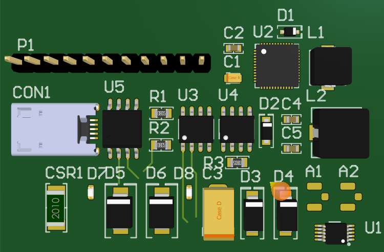
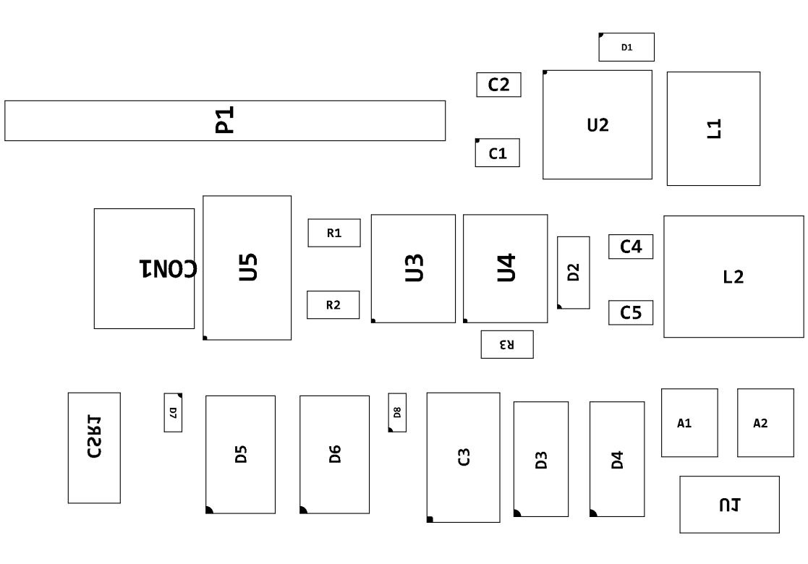

# AD Lib collection 

- 3D图

- 元件位置图

- 使用时要在工程里面做一下设置，按下L键，打开View Option，如下设置

  

Thanks to KitSprout and issus's Libs

https://github.com/KitSprout/AltiumDesigner_PcbLibrary

https://github.com/issus/altium-library